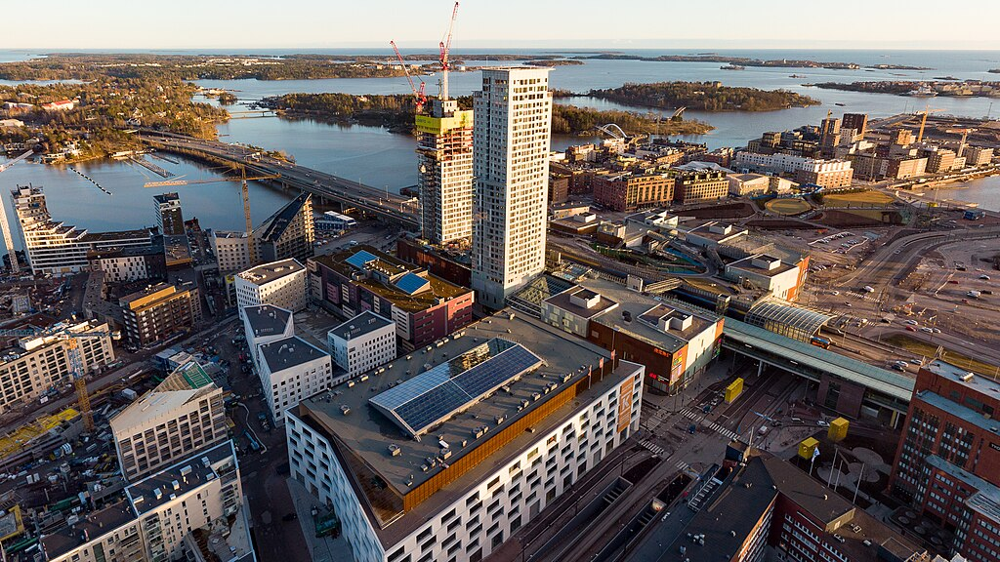

<!--
Allowed values:

type: district, plan

tags: Environment, Mobility, Buildings, Energy, InformationSystems, InnovationSystems, CivicTech, CivicInnovation
-->

## Overview

<!-- About 100 to 150 word summary of the case study. -->

Smart Kalasatama is a smart city district located in Helsinki, Finland, built on a former harbor area and envisioned as a living lab for urban innovation. With the ambitious goal of giving residents 'one more hour every day' the project integrates smart technologies into everyday life-ranging from energy-efficient buildings and autonomous shuttles to flexible shared spaces and real-time digital services. Developed through agile piloting, co-creation, and integrated digital infrastructure, Kalasatama is a testbed for sustainability, citizen-centered design, and public-private collaboration. The district serves as a model for how cities can align technology, urban planning, and community engagement to shape more livable and climate-resilient futures. 

## Goals and Aspirations

<!-- What is the project trying to achieve? Identify 3-5 high-level goals that define the entire project.Replace the placeholder title with a succinct name for the goal. -->

**Enhance daily life quality:**   
Smart Kalasatama give residents 'one more hour a day' by minimizing time spent on commuting and errands (through transit-oriented design and local services). This quality-of-life goal was co-created with early residents and drew global attention, reflecting a focus on convenient, 'smooth-flowing' daily life.

**Advance Sustainability and Climate:** 
Smart Kalasatama serves as a model for sustainable urban development, aligning with Helsinki's carbon-neutral 2035 target. Plans emphasize smart energy grids, renewable power, and efficient infrastructure to cut emissions. By integrating solar energy, electric mobility and green infrastructure, Kalasatama is a 'pioneer for Helsinki's climate targets', showing how digital solutions support a low-carbon lifestyle.

**Foster Innovation through Co-Creation:**  
Smart Kalasatama was conceived as an urban living lab and innovation platform where city officials, companies, researchers, and residents collaborate. A high-level goal is to support open innovation and get the best out of what new technologies can deliver for city services. This means actively piloting new ideas in a real district, attracting startups and industry to develop smart and sustainable solutions in cooperation with the community. Thus, the district's success is measured not just in tech deployment, but in establishing Helsinki as a world-class testbed for smart city solutions.

## Key Characteristics

<!--  How is the project organized into specific activities that advance these goals? For plans: How does the plan address each of the three activities in digital master plans (development, engagement, implementation). For districts: How does the district employ 3-5 of the key characteristics of innovation hubs?
-->

**Agile Development and Piloting:**  
Rather than fixed blueprints, Kalasatama evolved through agile pilot projects. Over 25 small-scale tech experiments (e.g., autonomous shuttles, energy optimization) informed scalable solutions and influenced city planning practices across Helsinki.

**Citizen-Centered Co-Creation:**  
Residents co-created the district's vision from the beginning. Workshops, Innovators' Clubs, and digital feedback tools helped shape everything from service apps to public space design. About a third of residents have actively participated in pilots.

**Integrated Planning and Smart Infrastructure:**  
Digital infrastructure was embedded from the ground up. All homes include smart meters, buildings are connected to a fiber network and district energy system, and waste is managed through underground vacuum collection, minimizing emissions and truck traffic.

## Stakeholders
<!--  Who initiated the project? Who is leading the project forward? Who else has a say in how it unfolds? Who is directly affected but marginalized? Identify 3-5 key stakeholder organizations or groups. Identify 3-5 key individuals. These are people who are associated with the project as leaders, supporters, critics, or regulators. They are likely to be members of the stakeholder groups identified above. These are people you should try to contact for one or more interviews.-->

**City of Helsinki & Forum Virium Helsinki:**  
The initiative is led by the [City of Helsinki](https://www.hel.fi/en), chiefly through [Forum Virium Helsinki](https://forumvirium.fi/en/) (the city's innovation company) which coordinated Smart Kalasatama. The city set the vision, provided land and funding, and convened partners. Multiple city departments (urban planning, transportation, housing, IT, etc.) were involved in implementation, aligning the project with municipal strategies. Forum Virium acted as the program manager and facilitator between public and private actors.

**Developers & Utilities:**  
The area's redevelopment involved private developers like [SRV](https://www.srv.fi/en/srv-as-a-company/investor/), which built major projects and implemented many smart infrastructure elements. City-owned utilities such as [Helen](https://www.helen.fi/en) (Helsinki Energy) were key for energy innovations, using their grids as a testbed for smart energy systems. The presence of these stakeholders ensured that smart solutions were installed in buildings and infrastructure as they were constructed.

**Startups & Technology Providers:**  
 A range of companies participated in Kalasatama's pilots and services. Dozens of local startups and small enterprises received micro-grants to test solutions like a smart parking app or a meal-sharing service. Larger firms also played a role. For instance, elevator company KONE and others contributed expertise in 'people flow' tech and platforms. The district became a hub where 'small, agile innovators and large established companies coexist and collaborate' on urban tech.

**Residents and Community Groups:**  
Kalasatama's residents are both end-users and co-creators. Adopters formed resident networks that helped shape the 'One More Hour' vision and volunteered in pilots. Residents also benefit via a local association that manages shared amenities (like urban gardens or a community living room), ensuring that even vulnerable or less tech-savvy groups can partake in the district's offerings. Thus community engagement ensured inclusive service design and encouraged everyday innovation.

**Academia & Research Partners:**  
Universities like Aalto and research institutions helped design digital tools and evaluate outcomes, ensuring evidence-based planning and knowledge transfer.

## Technology Interventions
<!--  What specific technology-enabled interventions does the project propose? Identify 3-5 technology interventions. Describe use cases, value proposition, solution architecture, data created or consumed, key platforms and standards, business models, regulatory issues, etc. Separate into more than 1 paragraph as needed. This is a good place to insert additional images, be sure to include captions identifying the source and make sure to not use copyrighted images. -->

**Smart Energy Grid & Data-Driven Energy Management:**
All buildings in Kalasatama are connected to a smart grid combining solar power, energy storage, and smart district heating. Every apartment includes smart meters that track detailed energy use, allowing residents to monitor consumption in real-time. Data is collected via IoT sensors and managed by city utility Helen. This enables efficient demand-response, helps reduce emissions, and supports the city's climate goals. The energy system is part of EU-funded projects and follows open standards for data sharing. It's a key example of how digital infrastructure can support low-carbon living.

**Flexi Spaces & Smart Shared Amenities:**
Kalasatama introduced "Flexi Spaces" shared rooms like gyms or meeting spaces in apartment buildings-equipped with smart locks and a mobile booking app. This system allows residents to use facilities across buildings, increasing utilization for redundant space. Developed through agile pilot funding, the platform logs reservations and usage data to help optimize access. It promotes social interaction, reduces costs, and supports sustainability. The initiative shows how tech can activate underused assets and enhance daily convenience for residents.

**Smart Mobility & Autonomous Shuttles:**
Kalasatama tested autonomous electric shuttles to provide last-mile transit to metro stations. These driverless minibuses, part of the EU SOHJOA project, operated with sensors, LIDAR, and GPS, sending real-time data to cloud systems. The pilot supported Helsinki's Mobility-as-a-Service (MaaS) vision, where residents can access various transport modes via a single app. The district also features shared e-cars, bike services, and smart traffic systems. These interventions reduce private car use and emissions, improving urban mobility while enhancing residents' daily efficiency.

## Financing
<!--  How are the technology interventions identified to be financed? How does this fit into financing of the larger project? Identify at least one financing mechanism that is being used. -->

**Public Funding and Innovation Grants:**
The City of Helsinki provided funding through Forum Virium, its innovation company. A key feature was the Agile Piloting Programme, which offered micro-grants (€1k-8k) to startups and community groups to prototype smart services. This minimized financial risk while enabling experimentation. Instead of committing to large vendor contracts, the city used these grants to test ideas quickly and scale only what worked.

**City Investment and Private Development:**
As the landowner, Helsinki invested in core infrastructure like fiber networks, streets, energy systems and used zoning and development agreements to require private developers to include smart features in new buildings. Developers like SRV funded the construction of residential towers and integrated systems like smart meters and automated waste collection, aligned with the city's digital master plan. The public-private partnership model allowed the city to embed smart infrastructure from the start without bearing all the cost.

**External Project Funding:**
Smart Kalasatama got additional money and support from the European Union. For example, it was part of EU-funded projects like mySMARTLife and BioTope, which helped pay for pilots in smart energy, mobility, and data-sharing platforms. These projects also brought in researchers and tech partners to develop and test solutions. Universities helped the city apply for grants and measure the impact of the projects. Some of the small pilots (like shared space apps or smart services) later became real businesses, supported by subscriptions or outside investors. City-owned companies like Helen (energy) also spent money on smart systems like solar power and electric vehicle charging. Altogether, this outside funding helped the city try out big ideas without needing to pay for everything from its own budget.

## Outcomes
<!-- What results has the project produced to date? What outcomes and impacts are anticipated? Identify 3-5 (anticipated) outcomes. What will/has the project achieved? Thes should not be the same or repeated from elsewhere. Use this space to emphasize something different. -->

**Active Community & Social Innovation:**
About one-third of Kalasatama residents have participated in pilots, indicating strong community engagement. Co-creation workshops and resident-driven projects have fostered social cohesion and trust in local governance. Residents helped shape services that reflect their real needs-such as shared spaces, smart mobility, and local amenities. This participatory model strengthened the sense of ownership and made the district a national reference for human-centered smart city design.

**Quality of Life Improvements:**
Kalasatama's concept of giving residents 'one more hour' a day reflects its focus on livability. Integrated services like shared Flexi Spaces, real-time transit apps, and local amenities save time and improve convenience. Residents report smoother daily routines with fewer errands and less need for car ownership. Other Smart solutions like energy dashboards and automated waste systems also contribute to cleaner, more efficient living environments.

**Environmental and Sustainability Impact:**
Smart energy systems and renewable integration have led to measurable energy savings (10-15% in pilot buildings). Automated waste collection reduces emissions, and green infrastructure supports climate resilience. Kalasatama is helping Helsinki advance its 2035 carbon-neutral goal. The neighborhood serves as a testbed for climate-friendly technologies that are being scaled citywide, setting an example for sustainable urban redevelopment.

**Innovation Diffusion and Economic Impact:**
The district's agile piloting model has been adopted across Helsinki and replicated in other Finnish cities. It helped launch startups and attracted international attention to Helsinki;s innovation ecosystem. Kalasatama is now a global smart city reference, hosting delegations and influencing policy. It has also boosted real estate values and local business, demonstrating how smart city projects can drive both innovation and economic development.

## Open Questions
<!-- What is uncertain, unclear, or still unresolved about this project? Identify 1-3 open question(s). -->

**Long-Term Viability of Pilots:**
Many services started as temporary experiments. While popular-like Flexi Spaces and autonomous shuttles is unclear whether will scale sustainably. Ongoing funding, platform maintenance, and institutional support are necessary. Without long-term plans, there's a risk that successful pilots may fade once initial grants end, limiting their impact beyond the testing phase.

**Scaling and Resource Demands:**
The agile piloting model requires high coordination and dedicated city resources. While effective in Kalasatama, duplicating this model in older neighborhoods or smaller cities may not be feasible. Can Helsinki adapt this model efficiently in less controlled, less resourced environments? Scaling up requires not just funding, but also political will and institutional capacity.

## References

---

### Primary Sources

<!-- 3-5 project plans, audits, reports, etc. -->
- Report on retrofitted actions and implemented actions in new buildings including RES and storage. 
Retrieved from https://www.mysmartlife.eu/fileadmin/user_upload/Deliverables/D4.2_Report_on_retrofitted_actions_and_implemented_actions_in_new_buildings_including_RES_and_storage.pdf
- mySMARTLife Helsinki.
Retrieved from https://smart-cities-marketplace.ec.europa.eu/projects-and-sites/projects/mysmartlife/mysmartlife-helsinki#description
- Smart Kalasatama - a district for experimentation. 
Retrieved from https://drive.google.com/file/d/1joV2jWyvfT32XAnUf1tfb0QtRfBs84kx/view
- Smart Kalasatama develops smart city together with citizens. 
Retrieved from https://www.interregeurope.eu/good-practices/smart-kalasatama-develops-smart-city-together-with-citizens#:~:text=accelerating%20Smart%20City%20innovation%20by,can%20participate%20and%20give%20feedback
- Smart Kalasatama - Smart City District of Helsinki. 
Retrieved from https://knowledge-hub.circle-economy.com/article/5234?n=Smart-Kalasatama---Smart-City-District-of-Helsinki&utm_source=chatgpt.com

### Secondary Sources

<!-- 5-7 secondary source documents: news reports, blog posts, etc.. -->

- Smart Kalasatama attracts innovation tourists to Helsinki. 
Retrieved from https://forumvirium.fi/en/smart-kalasatama-attracts-record-numbers-innovation-tourists-helsinki/
- mySMARTLife activities in Helsinki. Retrieved from https://www.mysmartlife.eu/cities/helsinki/